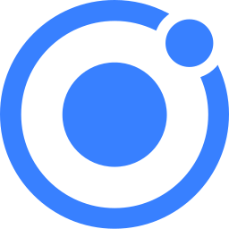

<h1 align="left" id="mohamednourdine-title">:wave: Hello there! I'm Mohamed Nourdine</h1>

><h3 align="left">I am a passionate Full Stack Web developer👨🏽‍💻</h3>

 

I have had the chance to occupy results-driven positions within the software engineering industry, utilizing my expertise and experience to efficiently develop intricate projects for a variety of companies.
 
 
My appreciation for the open-source community has provided me with valuable learning opportunities. I am fascinated by the collaborative and knowledge-sharing nature of open-source initiatives.
 
 

   
 

- :office: &nbsp;I'm currently working at **[Fembak Software]**
- :mailbox: &nbsp;Ask me anything on my **[issues page]**
- :computer: &nbsp;Connect with me on **[LinkedIn]**

 

<h2 align="left" id="mohamednourdine">Favorite Tech</h2>

> Tools, languages, and other things that I feel confortable working with.

<table>
  <tr>
    <td align="center" width="96">
      
       Laravel
    </td>
     <td align="center" width="96">
      
       Symfony
    </td>
    <td align="center" width="96">
      
       Java
    </td>
    <td align="center" width="96">
      
       Lumen
    </td>
     <td align="center" width="96">
      
       Python
    </td>
    <td align="center" width="96">
      
       Javascript
    </td>
     <td align="center" width="96">
      
       NodeJS
    </td>
    <td align="center" width="96">
      
       TypeScript
    </td>
    <td align="center" width="96">
      
       Flutter
    </td>
    <tr>
    
    <td align="center" width="96">
      
       Ionic
    </td>
     <td align="center" width="96">
      
       Electron Js
    </td>
    <td align="center" width="96">
      
       ReactJS
    </td>
    <td align="center" width="96">
      
       VueJS
    </td>
    <td align="center" width="96">
      
       Docker
    </td>
    <td align="center" width="96">
      
       Sass
    </td>
    <tr>
    <tr>
    <td align="center" width="96">
      
       Redis
    </td>
    <td align="center" width="96">
      
       MongoDB
    </td>
    <td align="center" width="96">
      
       MySql
    </td>
    <td align="center" width="96">
      
       Bootstrap
    </td>
    </tr>
  
  </tr>
  
</table>

<!-- links -->

[issues page]: https://github.com/mohamednourdine/mohamednourdine/issues "mohamednourdine/issues"
[linkedin]: https://www.linkedin.com/in/mnourdine/ "Mohamed Nourdine"
