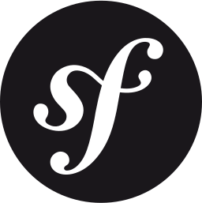

<h1 align="left" id="mohamednourdine-title">👋 Hello there! I'm Mohamed Nourdine</h1>

<h3 align="left">I am a passionate Full Stack Developer and Cloud Architect Enthusiast 👨🏽‍💻</h3>

 

  I have had the chance to occupy results-driven positions within the software engineering industry, utilizing my expertise and experience to efficiently develop intricate projects for a variety of companies.
    
  My appreciation for the open-source community has provided me with valuable learning opportunities. I am fascinated by the collaborative and knowledge-sharing nature of open-source initiatives.
    

 
 
 

- 💻 &nbsp;Connect with me on **[LinkedIn]**

<h2 align="left" id="mohamednourdine">Favorite Tech</h2>

> Tools, languages, and other things that I feel comfortable working with.

<table>
  <tr>
    <td align="center" width="96">
       Laravel
    </td>
    <td align="center" width="96">
       Symfony
    </td>
    <td align="center" width="96">
       Python
    </td>
    <td align="center" width="96">
       Javascript
    </td>
    <td align="center" width="96">
       NodeJS
    </td>
    <td align="center" width="96">
       TypeScript
    </td>
    <td align="center" width="96">
       Flutter
    </td>
  </tr>
  <tr>
    <td align="center" width="96">
       ReactJS
    </td>
    <td align="center" width="96">
       VueJS
    </td>
    <td align="center" width="96">
       Docker
    </td>
    <td align="center" width="96">
       Redis
    </td>
    <td align="center" width="96">
       MongoDB
    </td>
    <td align="center" width="96">
       MySQL
    </td>
    <td align="center" width="96">
      <!-- Optional: add another tech here, or leave blank -->
    </td>
  </tr>
</table>

<!-- links -->

[linkedin]: https://www.linkedin.com/in/mnourdine/ "Mohamed Nourdine"
